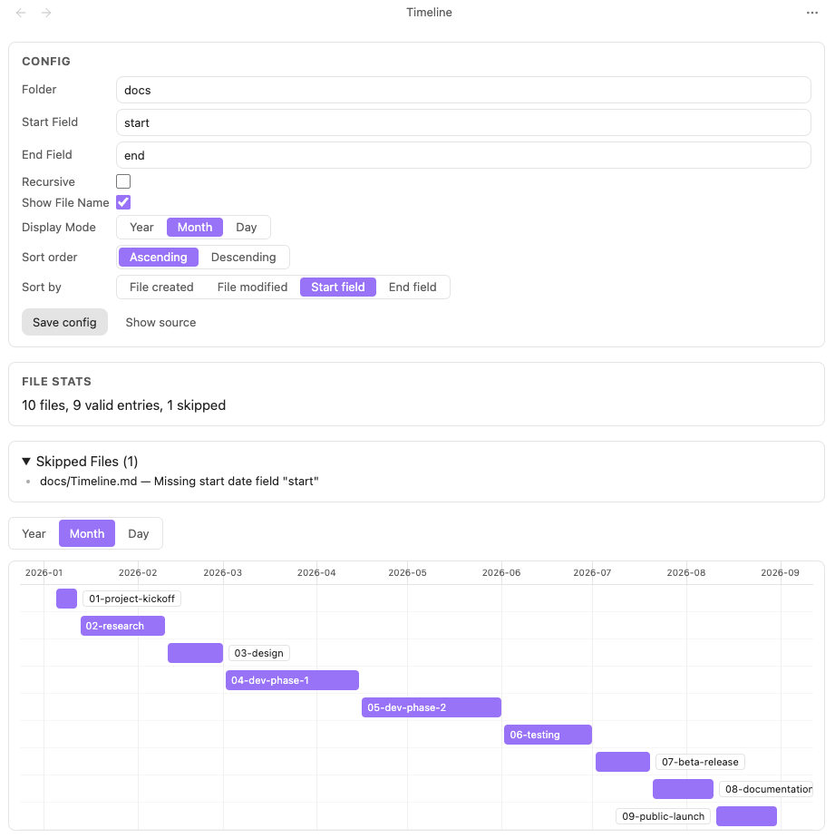

[中文文档](./README.zh.md)

<div align="center" style="padding: 5px; margin: 5px 0;color: #8b5cf6;font-size: 40px;">

**Turn any folder into a timeline** 

</div>




## Usage

1. Click the timeline icon in the left ribbon, or right-click a folder in the file explorer and choose "Open or create Timeline view in this folder".
2. The plugin creates a view config file (default template, with `folder` pre-filled to the target folder) and opens the timeline view.
3. Add `start` / `end` fields (or your custom field names configured in the template) to a note's frontmatter to put it on the timeline.

### View config file

A view config file is any regular Markdown file. When its frontmatter contains `timeline: true`, it is recognized as a view config file. You can edit and save it through the in-view form, or edit the file directly.

```yaml
---
timeline: true
folder: ""
recursive: false
startField: "start"
endField: "end"
showFileName: true
displayMode: "month"
sortBy: "start"
sortOrder: "asc"
---
```

| Field | Type | Required | Default | Description |
|---|---|---|---|---|
| `timeline` | boolean | yes | - | The file is treated as a view config file only when this is `true`. |
| `folder` | string | yes | - | Folder to display, a path relative to the vault root; empty string means the vault root. |
| `recursive` | boolean | no | `false` | Whether to scan all subfolders under `folder` recursively. |
| `startField` | string | yes | - | Start-time field name; read from each file's frontmatter. |
| `endField` | string | yes | - | End-time field name. |
| `showFileName` | boolean | no | `true` | Whether to show the file name on the bar. |
| `displayMode` | `"year"` \| `"month"` \| `"day"` | no | `"month"` | Timeline scale granularity. |
| `sortBy` | `"created"` \| `"modified"` \| `"start"` \| `"end"` | no | `"start"` | Sort key for bars (top to bottom). |
| `sortOrder` | `"asc"` \| `"desc"` | no | `"asc"` | Sort direction: ascending / descending. |

**Time value formats**: common Obsidian frontmatter formats are supported, such as `2026-08-06`, `2026-08-06T20:30:00`, `2026-08-06 20:30`, etc. A note with a start but no end renders as a single-point event (a circular marker); a start later than the end is treated as an invalid item and summarized in the view.

## Features

- **Hand-drawn timeline** (no third-party Gantt/Timeline library): year / month / day scales; the range auto-covers all items; items spanning years or months cross scale boundaries correctly.
- **Bar interaction**: hover feedback; click / Enter (keyboard-focusable) opens the note in Obsidian; optional file name on the bar (truncated with an ellipsis when too long).
- **Performance**: viewport rendering keeps scrolling smooth even with hundreds to thousands of files.
- **In-view config editing**: change the form and save to write back to the config file's frontmatter and refresh immediately; or edit the config file directly and reopen the view to apply.
- **Edge-case friendly**: broken config, missing folder, empty folder, notes without time fields, start after end — all show a clear message instead of crashing.
- **Local-first**: no network requests, no telemetry, no remote code execution.

## Installation

### From Obsidian Community Plugins (recommended)
1. Open Obsidian → Settings → Community plugins → Browse
2. Search for "Folder Timeline" and click Install
3. Enable the plugin

### Manual
1. Download the latest [Release](https://github.com/RudeCrab/obsidian-plugin-folder-timeline/releases)
2. Extract and copy the folder to `<your-vault>/.obsidian/plugins/`
3. Restart Obsidian and enable the plugin in Settings

## Development

```bash
pnpm install   # install dependencies (package manager is pinned to pnpm)
pnpm dev   # build in watch mode
pnpm build # production build, outputs main.js
pnpm lint  # run ESLint
```

## License

MIT
