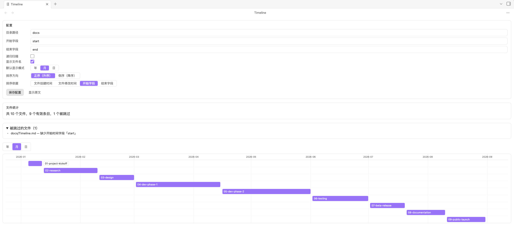

[English](./README.md)

<div align="center" style="padding: 5px; margin: 5px 0;color: #8b5cf6;font-size: 40px;">

**把任意目录变成时间轴** 

</div>




## 使用方法

**目录模式** — 把任意目录变成时间轴：

1. 左侧 Ribbon 点击时间线图标，或在文件管理器的目录上右键。
2. 插件自动创建视图配置文件并打开时间轴。
3. 在笔记 frontmatter 中写入 `start` / `end` 字段即可上轴。

**Base 模式** — 在 Obsidian Base 中嵌入时间轴：

1. 打开任意 `.base` 文件 → **Layout** → **+ Add View** → 选择 **Timeline**。
2. 在视图选项中，选择你的**开始时间属性**和**结束时间属性**。
3. 时间轴即时渲染 — 筛选、排序、分组全由 Base 负责，你只需要指定时间字段。

### 视图配置文件

视图配置文件是任意位置的普通 Markdown 文件，frontmatter 含 `timeline: true` 即被识别为视图配置文件。可在视图内通过表单编辑并保存，也可以直接编辑文件本身。

```yaml
---
timeline: true
folder: ""
recursive: false
startField: "start"
endField: "end"
showFileName: true
displayMode: "month"
sortBy: "start"
sortOrder: "asc"
---
```

| 字段 | 类型 | 必填 | 默认值 | 说明 |
|---|---|---|---|---|
| `timeline` | boolean | 是 | - | 值为 `true` 时该文件才被视为视图配置文件 |
| `folder` | string | 是 | - | 要展示的目录，相对 vault 根目录的路径；空字符串表示 vault 根目录 |
| `recursive` | boolean | 否 | `false` | 是否递归扫描 `folder` 下的所有子目录 |
| `startField` | string | 是 | - | 开始时间字段名，读取每个文件 frontmatter 中该字段的值 |
| `endField` | string | 是 | - | 结束时间字段名 |
| `showFileName` | boolean | 否 | `true` | 是否在时间条上显示文件名 |
| `displayMode` | `"year"` \| `"month"` \| `"day"` | 否 | `"month"` | 时间轴刻度粒度 |
| `sortBy` | `"created"` \| `"modified"` \| `"start"` \| `"end"` | 否 | `"start"` | 时间条（从上到下）的排序依据 |
| `sortOrder` | `"asc"` \| `"desc"` | 否 | `"asc"` | 排序方向：正序（升序）/ 倒序（降序） |

**时间值写法**：支持 Obsidian frontmatter 中常见格式，如 `2026-08-06`、`2026-08-06T20:30:00`、`2026-08-06 20:30` 等。只有开始时间、无结束时间时渲染为单点事件（圆形标记）；开始时间晚于结束时间视为无效条目并在视图中汇总提示。

## 功能

- **Obsidian Base 集成** — 在 Base 中添加 *Timeline* 视图，与 Table、Board、Calendar、Gallery 同等待遇。Base 自带的筛选、排序、分组全部可用，时间轴只管渲染。
- **自绘时间轴**（零第三方 Gantt/Timeline 依赖）：年 / 月 / 日三种刻度；范围自动覆盖全部条目；跨年 / 跨月正确跨越刻度。
- **时间条交互**：hover 反馈；点击 / 回车（键盘可聚焦）在 Obsidian 中打开对应笔记；空间足够时在条上显示文件名。
- **性能**：数百至上千文件采用可视区域渲染，60 fps 流畅滚动。
- **视图内编辑配置**（目录模式）：表单改完保存即写回配置文件并即时刷新。
- **边界情况友好**：配置损坏、目录不存在、目录为空、缺时间字段、开始晚于结束等均有明确提示，不崩溃。
- **本地优先**：无网络请求、无遥测、无远程代码执行。

## 安装

### 通过第三方插件（推荐）
1. 打开 Obsidian 软件 → 设置 → 第三方插件 → 浏览
2. 搜索【Folder Timeline】并安装
3. 启用插件

### 手动安装
1. 下载最新的 [Release](https://github.com/RudeCrab/obsidian-plugin-folder-timeline/releases)
2. 解压后将文件夹复制到 `<你的库>/.obsidian/plugins/`
3. 重启 Obsidian 并在设置中启用插件


## 开发

```bash
pnpm install   # 安装依赖（包管理器固定为 pnpm）
pnpm dev   # 监听模式构建
pnpm build # 生产构建，产出 main.js
pnpm lint  # ESLint 检查
```

## License

MIT
